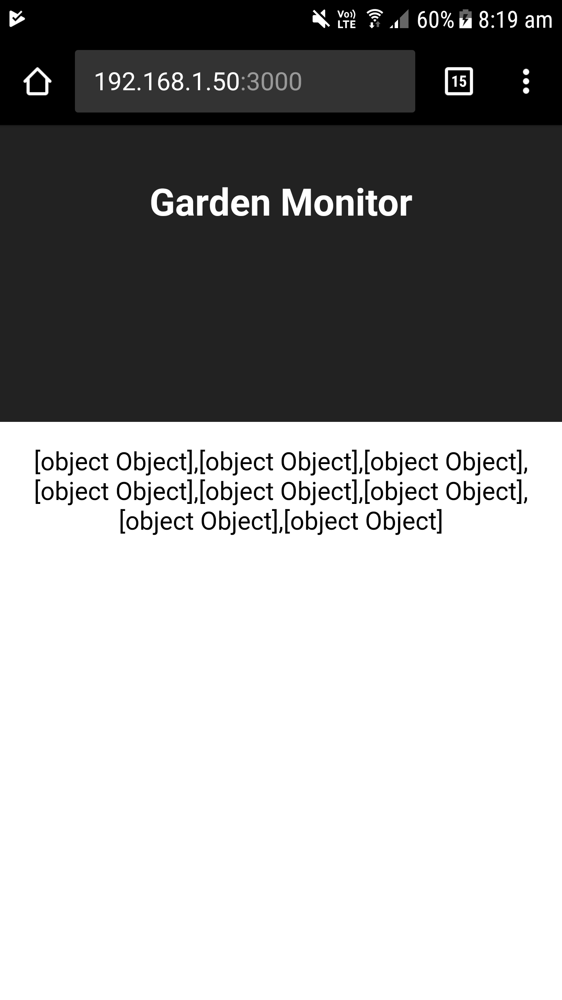

React App: Connection with API
===============================

Aim
----
Set up webserver to fetch data from the postgres db using the flask api. 

Summary
--------
By the end of this page you should have a react web page running on your local network that fetches data. We wont be doing anything with the data once we have it, more on that next.

Requirements
--------------
- Flask api 
- Postgres DB
- React app 

Note on datetime stamps
-------------------------
All records have a datestamp which are used for processing and data visualisation. Postgres saves the datestamp as a string (dsCollected column) in ISO 8601 format along with timezone information. For example, "2017-10-18T10:30:00+10:00" is 10:30 am in Sydney on the 18th of October 2017. These strings get converted to a Date data type after they are collected by the react app.   

Drop existing data
--------------------

.. code-block:: bash
	
    psql homesensors ray

.. code-block:: psql

    drop table home_sensor_data;

.. warning: If you drop the table called home_sensor_data then you will also need to restart the Flask API. You need to do this because the home_sensor_data table is created by Flask if it doesn't already exist.

Add test data
--------------

.. code-block:: bash
	
    #/repos/homesensors/flask/bin
    source activate
 
    #(flask)/repos/homesensors/flask/bin
    app.py

    # open another terminal
    # => ctrl-shft-t

    # add records
    # 1
    curl -i -H "Content-Type: application/json" 
         -X post 
         -d '{"name": "tomatoes",
              "location":"garden",
              "category":"actual",
              "measurementType":"temp", 
              "value": 16, 
              "dsCollected": "2017-11-18T10:30:00+11:00
             "}' 
         http://localhost:5000/homesensors/api/v1.0/sensor_data

    # 2
    curl -i -H "Content-Type: application/json" 
         -X post 
         -d '{"name": "tomatoes",
              "location":"garden",
              "category":"actual",
              "measurementType":"temp", 
              "value": 17, 
              "dsCollected": "2017-11-18T11:30:00+11:00
             "}' 
         http://localhost:5000/homesensors/api/v1.0/sensor_data

    # 3
    curl -i -H "Content-Type: application/json" 
         -X post 
         -d '{"name": "tomatoes",
              "location":"garden",
              "category":"actual",
              "measurementType":"temp", 
              "value": 18, 
              "dsCollected": "2017-11-18T12:30:00+11:00
             "}' 
         http://localhost:5000/homesensors/api/v1.0/sensor_data

    # 4
    curl -i -H "Content-Type: application/json" 
         -X post 
         -d '{"name": "tomatoes",
              "location":"garden",
              "category":"actual",
              "measurementType":"temp", 
              "value": 19, 
              "dsCollected": "2017-11-18T13:30:00+11:00
             "}' 
         http://localhost:5000/homesensors/api/v1.0/sensor_data

    # 5
    curl -i -H "Content-Type: application/json" 
         -X post 
         -d '{"name": "tomatoes",
              "location":"garden",
              "category":"actual",
              "measurementType":"temp", 
              "value": 17, 
              "dsCollected": "2017-11-18T14:30:00+11:00
             "}' 
         http://localhost:5000/homesensors/api/v1.0/sensor_data

Add a proxy to webserver
-------------------------
Security restrictions block the transfer of data on localhost. To connect the react webserver (localhost port 3000) to the flask api (localhost post 5000) add a proxy setting to package.json.

.. code-block:: bash
	
    nano /repos/homesensors/reactapp/package.json

.. code-block:: json

    {
      "name": "reactapp",
      "version": "0.1.0",
      "private": true,

      // add proxy setting here...
      "proxy": "http://localhost:5000/",

      "dependencies": {
        "react": "^16.0.0",
        "react-dom": "^16.0.0",
        "react-http-request": "^1.0.3",
        "react-scripts": "1.0.14"
      },
      "scripts": {
        "start": "react-scripts start",
        "build": "react-scripts build",
        "test": "react-scripts test --env=jsdom",
        "eject": "react-scripts eject"
      }
    }

Edit App.js (react webapp)
-------------------------------

.. code-block:: bash

    nano /repos/homesensors/reactapp/src/app.py

.. code-block:: python

	import React, { Component } from 'react';
	import './App.css';

	class App extends Component {
	    constructor(props){
	      super(props);
	
	      this.state={
	         data: "Fetching data"
	      }
	    }
	
	    componentWillMount() {
	       this.getDataFromApi()
	    };
	
	    getDataFromApi() {
	      return fetch('/homesensors/api/v1.0/sensor_data', {credentials: 'same-origin'})
	        .then((response) => response.json())
	        .then((responseJson) => {
	          this.setState({
	               data: responseJson.data
	          }, () => console.log("Success"))})
	        .catch((error) => {
	          console.error(error);
	          });
	    }
	
	    render() {
	      return (
	        

	        <header className="App-header">
	            <h1 className="App-title">Garden Monitor</h1>
	        </header>
	        
 {String(this.state.data)} 

	
	        

	       );
	   }
	}
	
export default App;

Test
-------

.. code-block:: bash

    # Run flask api 
    cd /repos/homesensors/flask/bin
    source activate
    app.py

    # Run react webapp
    cd /repos/homesensors/reactapp
    npm start

