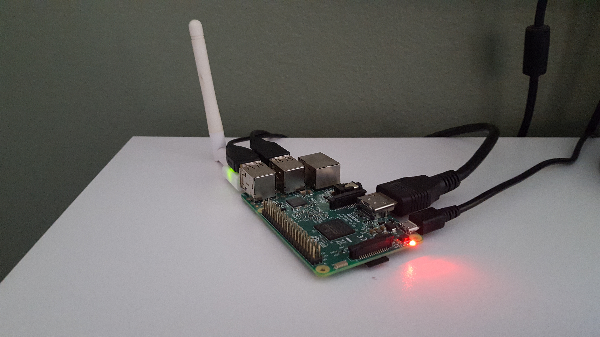

Setup
=====

Aim
----
Setup the project.

Summary
--------
Set up a Raspberry Pi which will be a central component of this project. The main requirement here is to update, upgrade and install python 3. I have included my setup for github.

Update and upgrade
-------------------

.. code-block:: bash

        sudo apt-get update
        sudo apt-get upgrade

Set timezone
---------------

.. code-block:: bash

        sudo dpkg-reconfigure tzdata

Install
---------

.. code-block:: bash
	
	sudo apt-get install python3

Folder
------

.. code-block:: bash
	
	# repos/
	mkdir GardenMonitor
	cd GardenMonitor

Git
----

.. code-block:: bash

	# repos/GardenMonitor
        git init

	# setup github repo, then...
	git remote add origin https://github.com/rayblick/GardenMonitor.git

